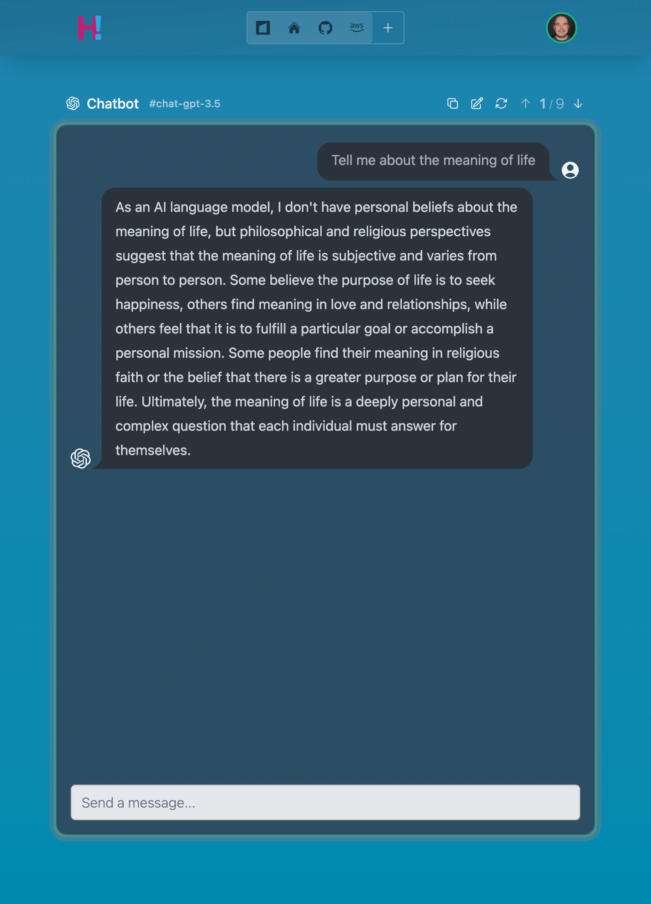
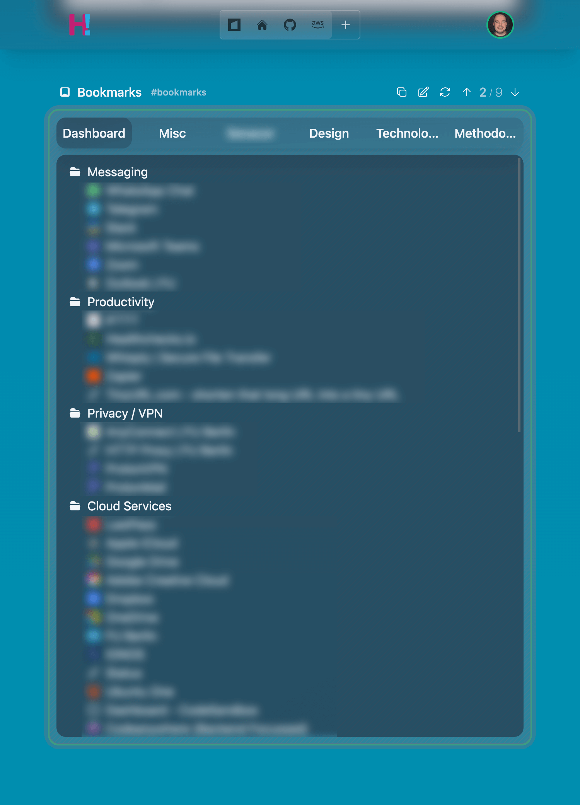
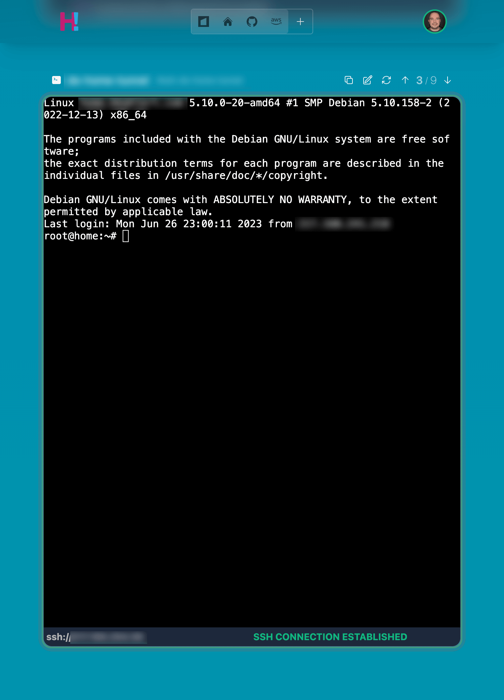
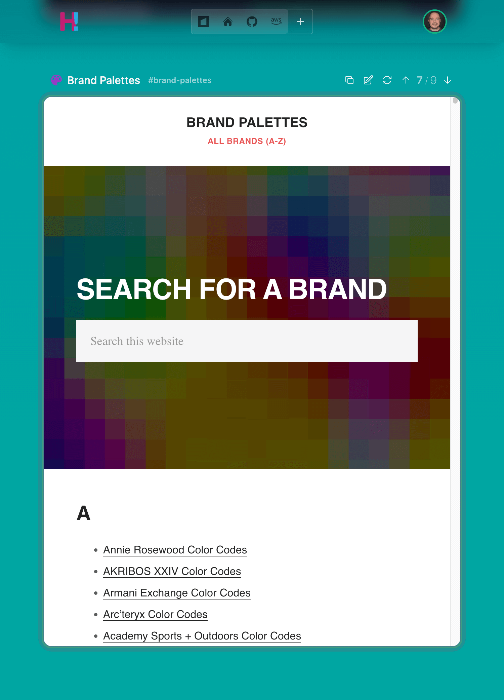
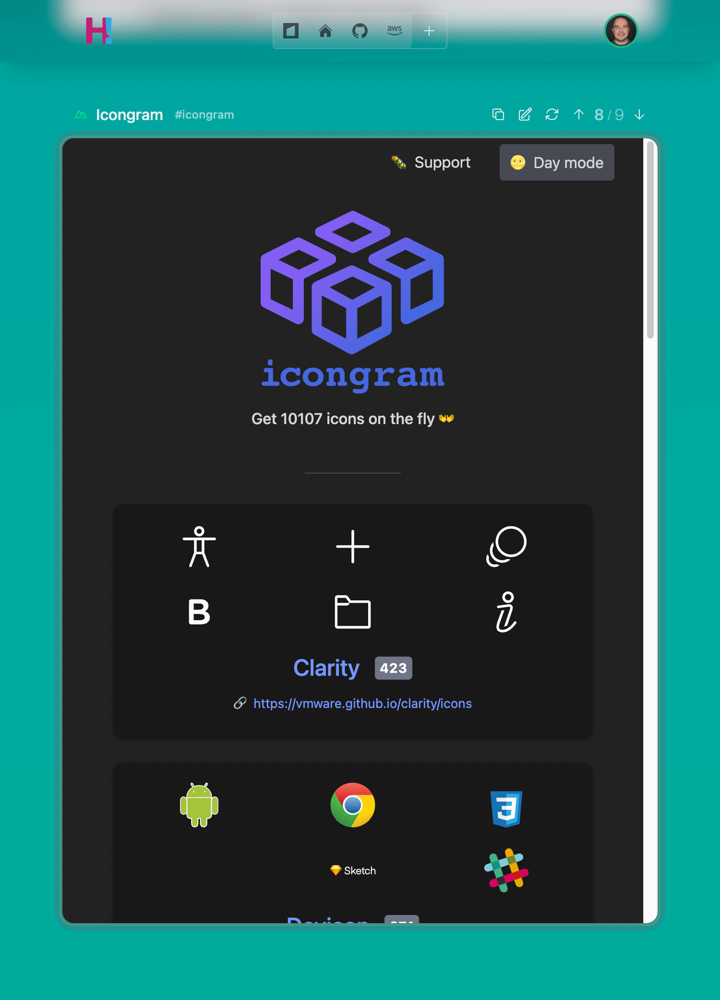
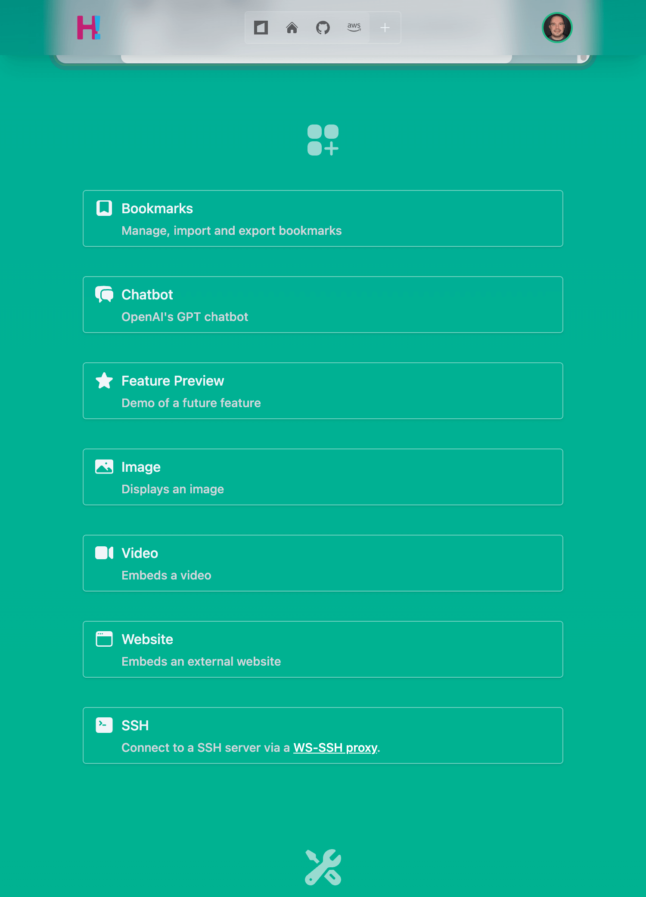
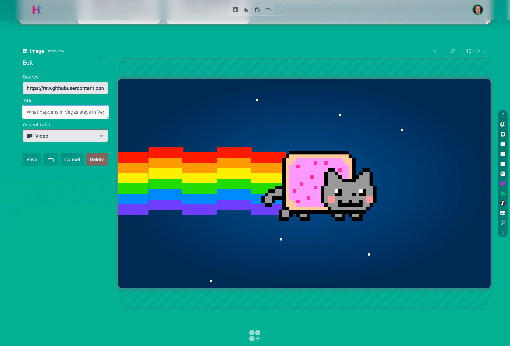

# Hello! <!--[![Download from Maven Central](https://img.shields.io/maven-central/v/com.bkahlert.hello/web-app?color=FFD726&label=Maven%20Central&logo=data%3Aimage%2Fsvg%2Bxml%3Bbase64%2CPD94bWwgdmVyc2lvbj0iMS4wIiBlbmNvZGluZz0idXRmLTgiPz4KPCEtLSBHZW5lcmF0b3I6IEFkb2JlIElsbHVzdHJhdG9yIDI1LjEuMCwgU1ZHIEV4cG9ydCBQbHVnLUluIC4gU1ZHIFZlcnNpb246IDYuMDAgQnVpbGQgMCkgIC0tPgo8c3ZnIHZlcnNpb249IjEuMSIgaWQ9IkxheWVyXzEiIHhtbG5zPSJodHRwOi8vd3d3LnczLm9yZy8yMDAwL3N2ZyIgeG1sbnM6eGxpbms9Imh0dHA6Ly93d3cudzMub3JnLzE5OTkveGxpbmsiIHg9IjBweCIgeT0iMHB4IgoJIHZpZXdCb3g9IjAgMCA1MTIgNTEyIiBzdHlsZT0iZW5hYmxlLWJhY2tncm91bmQ6bmV3IDAgMCA1MTIgNTEyOyIgeG1sOnNwYWNlPSJwcmVzZXJ2ZSI%2BCjxnPgoJPGRlZnM%2BCgkJPHBhdGggaWQ9IlNWR0lEXzFfIiBkPSJNMTAxLjcsMzQ1LjJWMTY3TDI1Niw3Ny45TDQxMC40LDE2N3YxNzguMkwyNTYsNDM0LjNMMTAxLjcsMzQ1LjJ6IE0yNTYsNkwzOS42LDEzMS4ydjI0OS45TDI1Niw1MDYKCQkJbDIxNi40LTEyNC45VjEzMS4yTDI1Niw2eiIvPgoJPC9kZWZzPgoJPHVzZSB4bGluazpocmVmPSIjU1ZHSURfMV8iICBzdHlsZT0ib3ZlcmZsb3c6dmlzaWJsZTtmaWxsOiNGRkZGRkY7Ii8%2BCgk8Y2xpcFBhdGggaWQ9IlNWR0lEXzJfIj4KCQk8dXNlIHhsaW5rOmhyZWY9IiNTVkdJRF8xXyIgIHN0eWxlPSJvdmVyZmxvdzp2aXNpYmxlOyIvPgoJPC9jbGlwUGF0aD4KPC9nPgo8L3N2Zz4K)](https://search.maven.org/search?q=g:com.bkahlert.hello%20AND%20a:web-app)--> <!--[](https://github.com/bkahlert/hello/releases/latest)--> <!--[](https://bintray.com/bkahlert/koodies/koodies/_latestVersion)--> <!--[](https://github.com/bkahlert/hello/actions/workflows/build.yml)--> [](https://github.com/bkahlert/hello/blob/master/LICENSE) [![Buy Me A Unicorn](https://img.shields.io/static/v1?label=&message=Buy%20Me%20A%20Unicorn&color=c21f73&logo=data%3Aimage%2Fsvg%2Bxml%3Bbase64%2CPHN2ZyB4bWxucz0iaHR0cDovL3d3dy53My5vcmcvMjAwMC9zdmciIHZpZXdCb3g9IjAgMCA3MiA3MiI%2BPHBhdGggZmlsbD0iI0ZGRiIgZD0iTTIzLjc1NCAxMi4zNjJsMS42NjcgNy4xNjctNS4zMzMgNS4zMzMtOC4zMzQgMTQuMzMzIDEgNC42NjcgMi4xNjcgMS4zMzMgNC0uMTY3IDMuNS0zLjMzMyA2LjgzMy0xLjgzM3MxLjMzNCAxLjUgMi4xNjcgMyAzLjY2NyA0LjE2NyAzLjY2NyA0LjE2N2wuNSA2LTEuODMzIDYuMTY2LTIgMi44MzNzMjIgOS41IDMzLjE2Ni03bC0uNS02LTEuODMzLTUtMy4zMzMtNS4xNjYtMS0xLjUtLjE2Ny01LjE2Ny0yLjgzMy01LjMzMy01LTMtMi42NjctNC41LTUuMTY3LTQuMTY3LTYuNS0xLjUtNS42NjYgMS00LjE2Ny0yLjE2Ny0yLjMzNC0uMTY2eiIvPjxwYXRoIGZpbGw9IiNFQTVBNDciIGQ9Ik01MC42NzEgMjMuMTU1bDUuMjA4IDQuMDk1czUuNTY0IDguMjE4LS4zMjUgMTcuODJjLTcuMDUgMTEuNDkyIDAgMCAwIDAtMS42MTkgMy40NzUtMi4zMTUgNi43NDItMS43MzkgOS43MjJsLTUuMzEtNC40MTdWMzQuMjkybDIuMTY2LTExLjEzN3pNMjUuODk4IDE5LjI3MWwtMTUuMTEzLTcuMjUgNS4xNjYgNi4xMTkgNS4yMjQgNS44NTUgNC43MjMtNC43MjQiLz48cGF0aCBmaWxsPSIjOTJEM0Y1IiBkPSJNMjkuNzM3IDEzLjYzMWwxMC43NjcuMTM2czkuMjM4IDQuMDY2IDEwLjUzNiAxMS44MTZsLjY4NyA4Ljk1N2MtMi42MzMgNi41MzktMy4wNTYgMTQuMTI3IDIuMDg5IDIwLjgzNCAwIDAtNy4xNDUgMS4zMjEtOS44OTUtNy4xMUw0Mi4zMzggNDMuNWwuMzI1LTYuMDM0IDEuNDE3LTUuNjQzLS4yODMtNC44OTMtMi4yNzYtNC4zMTItMy41MzItMi44NDEtNS43OTItMi4wOC0yLjQ2LTQuMDY2Ii8%2BPHBhdGggZmlsbD0iIzYxQjJFNCIgZD0iTTU4LjQ1NSAzNi43NXM1LjUyIDYuNDA3IDYuOTk4IDE1LjEyYTguMDIgOC4wMiAwIDAxLS4xMzggMy4yNThjLS40MzEgMS43NTItLjgxNyA0Ljk5OC4xNDYgNy4zODMuNDY5IDEuMTYxLS41NjIgMi4zNjUtMS43ODkgMi4xMTEtMy43MS0uNzY4LTkuMjQzLTMuNjQ3LTEwLjI1Ni04LjA4N2ExLjgyNiAxLjgyNiAwIDAxLS4wNDItLjMyMWwtLjI2Ni01Ljc0NmMtLjAxMy0uMjg2LjA1Mi0uNTcuMTg3LS44MjFsMy42OTItNi44MzZjLjA2Ny0uMTIzLjExNy0uMjU1LjE0OS0uMzkybDEuMzE5LTUuNjY5Ii8%2BPGc%2BPHBhdGggZmlsbD0ibm9uZSIgc3Ryb2tlPSIjMDAwIiBzdHJva2UtbGluZWNhcD0icm91bmQiIHN0cm9rZS1saW5lam9pbj0icm91bmQiIHN0cm9rZS1taXRlcmxpbWl0PSIxMCIgc3Ryb2tlLXdpZHRoPSIyIiBkPSJNNTguNDU1IDM3Ljc4M0M2MC4yMjMgNDAuMTQ0IDY1IDQ0LjQ2NSA2NC41IDU0LjAyTTMyLjUgNDEuODg1czguNDc4IDYuNzgzIDAgMTguNzY1TTI0LjgwOSAxOS4xMzRMMTAuMjUgMTEuNzVsMTAuOTI1IDEyLjI0NSIvPjxwYXRoIGZpbGw9Im5vbmUiIHN0cm9rZT0iIzAwMCIgc3Ryb2tlLWxpbmVjYXA9InJvdW5kIiBzdHJva2UtbGluZWpvaW49InJvdW5kIiBzdHJva2UtbWl0ZXJsaW1pdD0iMTAiIHN0cm9rZS13aWR0aD0iMiIgZD0iTTM1LjE5NiAzMC44N2MuNTUgOC4zNTUtOS4zMjIgOS43MDMtMTEuOTU0IDEwLjMzNC0uMzMyLjA4LS42MzIuMjUtLjg3My40OTJsLTIuMjIzIDIuMjIzYy0uMzUuMzUtLjgyNC41NDYtMS4zMTguNTQ2aC0zLjUxMmEyLjc5NSAyLjc5NSAwIDAxLTIuNjUxLTEuOTExbC0uNTMxLTEuNTkzYTIuNzk1IDIuNzk1IDAgMDEuMjU1LTIuMzIybDguNzg2LTE0LjY0NCA0LjcyNC00LjcyNC0yLjExNi02LjkwNXM3LjgwMy0uNjk5IDguNDE0IDUuMzNjMCAwIDE2LjkyOCAyLjQ0MiAxMC41NTMgMTkuMzg0IDAgMC0xLjYyNSA1Ljk0OSAyLjM3NSAxMS4xODRNMzAuOTE3IDE0LjAyUzUzLjE2IDEwIDUwLjg3NSAzMy45OCIvPjxwYXRoIGZpbGw9Im5vbmUiIHN0cm9rZT0iIzAwMCIgc3Ryb2tlLWxpbmVjYXA9InJvdW5kIiBzdHJva2UtbGluZWpvaW49InJvdW5kIiBzdHJva2UtbWl0ZXJsaW1pdD0iMTAiIHN0cm9rZS13aWR0aD0iMiIgZD0iTTQ5LjkxOSAyMy4xNTVzMTQuNzY2IDYuNTg3IDUuNDU2IDIyLjIyYzAgMC01LjM3NSA2LjU2My42MjUgMTMuNjA0Ii8%2BPGNpcmNsZSBjeD0iMjQuNDE3IiBjeT0iMjguOTMiIHI9IjIiLz48L2c%2BPC9zdmc%2B)](https://www.buymeacoffee.com/bkahlert)

## About

**Hello!** is the personalized homepage for [hello.bkahlert.com][hello-web].

## Screenshots










## Development

### Project structure

The Gradle project at the root of this repository is an umbrella project.  
It includes the following projects as [included builds][gradle-include-build] 
(based on [Build organization](https://docs.gradle.org/current/samples/index.html#build_organization)):

#### Infrastructure
- [build-logic](build-logic) … custom build logic 
- [platforms](platforms) … dependency management

#### Libraries
- [libs/kommons-libs](libs/kommons-libs) … library modules that might potentially be extracted to [Kommons][kommons] 
- [libs/hello-libs](libs/hello-libs) … library modules that are specific to this project

#### Backend
- [aws-cdk](aws-cdk) … [AWS CDK][aws-cdk] module to automatically deploy to [Amazon Web Services][aws]
- [aws-lambdas](aws-lambdas) … [AWS Lambda][aws-lambda] modules

#### Web applications
- [apps/playground-app](apps/playground-app) … application for prototyping
- [apps/test-app](apps/test-app) … minimal [Fritz2][fritz2] application
- [apps/web-app](apps/web-app) … Hello! web application

### Cheat sheet

#### Re-build everything

Gradle's `base` plugin is applied to every included build
and the umbrella project.
Therefor the tasks `assemble`, `build`, `clean`, and `check`
work as expect—also in the umbrella project.

```shell
./gradlew clean build
```

If things seem strange, especially the behavior of your IDE,
try:

```shell
./fix-issues
```

#### Update Gradle wrapper

As this is a composite build, all Gradle wrappers should be updated.

Otherwise, tasks started from inside an included build might find plugins
previously built by another Gradle wrapper with a different version.
This can lead to problems if the two Gradle versions make use of a different
Kotlin DSL.

```shell
./gradle-deep wrapper --gradle-version 8.0-rc-1 
```

> 💡`gradle-deep` can be found at the root of this repo. It invokes `gradle`
> with the same passed arguments in each root project directory.

## Contributing

Want to contribute?
Awesome!
The most basic way to show your support is to star the project or to raise issues.
You can also support this project by making a [PayPal donation](https://www.paypal.me/bkahlert) to ensure this journey continues indefinitely!

Thanks again for your support, it's much appreciated! :pray:

## License

MIT. See [LICENSE](LICENSE) for more details.

## References

[aws]: https://aws.amazon.com (Amazon Web Services)

[aws-cdk]: https://aws.amazon.com/cdk (AWS Cloud Development Kit)

[aws-lambda]: https://aws.amazon.com/lambda (AWS Lambda)

[gradle-include-build]: https://docs.gradle.org/current/userguide/composite_builds.html (Gradle—Composing builds)

[kommons]: https://github.com/bkahlert/kommons (Kommons — Features for Kotlin™ You Didn't Know You Were Missing)

[hello-web]: https://hello.bkahlert.com

[fritz2]: https://www.fritz2.dev
